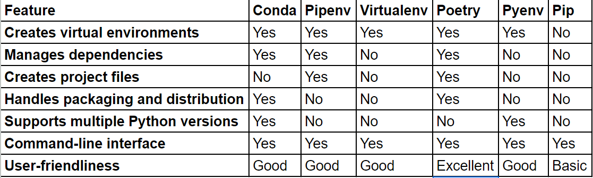

# gmail-purger
gmail is almost full, time to cleanup:
- using python and gmail api
- get all the  email senders  in your email account
- identify sneder's whose email you can dicard entirely or by date range
- delete email by sender by date range

> I will be using poetry

## how to use poetry
- **Installation**: First, you need to install Poetry. After installation, make sure to add Poetry's bin directory to your PATH.
  You can do this by running the following command in your terminal:
  ```sh
  curl -sSL https://install.python-poetry.org | python3 -
  # show poetry version
  poetry --version
  ```
- **Initialize Poetry:** Navigate to your project directory and initialize Poetry by running:
  ```sh
  poetry init
  ```
  Above command will guide you through creating a pyproject.toml file, which is used to manage your project's dependencies and settings.

- **Adding dependencies** to your project using the poetry add command. This command updates the pyproject.toml file and also
  creates a poetry.lock file to lock the versions of your dependencies.For example, **to add the requests library**, you would run:
  ```sh
  poetry add requests
  ```
  
- **Install Dependencies and create venv:** To install the dependencies specified in your pyproject.toml file, run:
  ```sh
  poetry install
  ```
  and this will create a virtual environment for your project and install the dependencies within it.

- **Running Your Project:** To run your project within the Poetry-managed virtual environment, you can
  use the poetry run command. For example:
  ```sh
  poetry run python main_script.py
  ```

- **Building and Publishing:** If you want to build your project into a distributable package, you can use:
```sh
  poetry build
```
- To publish your package to PyPI, use:
    ```sh
      poetry publish
    ```

 > Remember to commit the pyproject.toml and poetry.lock files to your version control
 > system to ensure consistent environments for all contributors to your project.   
      
-  **List all virtual environments managed by Poetry**, you can use the following command:
```sh
poetry env list
```

- **Like pipenv clean**
  In Poetry, there is no direct equivalent to the pipenv clean command, which removes packages not specified in the Pipfile.
  However, you can achieve a similar result by using the poetry install command with the --remove-untracked option.

  This option will remove packages that are **not specified in the pyproject.toml** file from the virtual environment.
  Following will ensure that your virtual environment only contains the packages specified in your pyproject.toml file,
  similar to how pipenv clean works for Pipfile.
  ```sh
  poetry install --remove-untracked
  ```
- **Like pipenv install --dev**
   In Poetry, to install development dependencies, you use the poetry add command with the --dev flag. This is similar
   to how you would use pipenv install --dev in Pipenv. Here's an example:
    ```sh
    poetry add --dev pytest
    ```
    _Above command will add pytest as a development dependency to your project, updating the pyproject.toml and poetry.lock
    files accordingly._
      
- **Remove the Virtual Environment**
 Use the poetry env remove command to remove the current virtual environment. You need to specify the environment's name,
 which you can get from poetry env list.
 ```sh
  poetry env list  # Find the name of the current environment
  poetry env remove one_of_the_listed_envs  
 ```

- **Reinstall Dependencies**
 Run poetry install to create a new virtual environment and reinstall all dependencies (both default and development)
 based on the pyproject.toml and poetry.lock files.
  ```sh
  poetry install
  ```
- **path of the virtual environment associated with your project**
  Use the poetry env info command.
  ```sh
  poetry env info --path
  ```
- **List all the packages installed in your project's**
  ```sh
  #  list the packages installed in your project's virtual environment
  poetry show
  # This command will list all the packages installed in your project's virtual environment, along with their versions
  poetry show --tree
 ```

- **generate a requirements.txt**
 ```sh
   # to generate a requirements.txt file similar to using pipenv lock -r, you can use the poetry export
   poetry export -f requirements.txt --output requirements.txt
   # If you want to include only the main dependencies and exclude the development dependencies, you can add the --without dev
   poetry export -f requirements.txt --output requirements.txt --without dev
  ```

- **Visualize the dependency graph of your project (similar to pipenv graph)**
  ```sh
  poetry show --tree
  ```
  Above command will display a tree-like structure of your project's dependencies, showing how each package is related to
  others in terms of dependency. It's a useful way to understand the hierarchy and relationships between the packages in your project.

- **Execute pytest# 
  ```sh
  # To run pytest with the -vv flag on the test/ directory
  poetry run pytest -vv test/
  ```

- **Activate a virtual env**
  Navigate to the root directory of your project where the pyproject.toml file is located.
  Run the following command:
  ```sh
  poetry shell
  ```
  Above command will spawn a new shell with the virtual environment activated. You'll notice that the
  name of the virtual environment is usually displayed in your terminal prompt, indicating that the virtual environment is active.
  To deactivate the virtual environment and return to your original shell, you can type exit or press Ctrl + D.
    
- **Activate a virtual env from a list of  my configured envs**
   ```sh
   # list all venv's
   poetry env list
   
   ## output
   # my-project-py3.8 (Activated)
   # my-project-py3.9

   # exit from the current env using exit or ctrl+d 
   
   # switcching to my-project-py3.9
   poetry env use python3.9
   poetry shell
   ```
  
## poetry and requirements.txt
Here's how you can work with Poetry and requirements.txt:
Converting requirements.txt to Poetry: If you have an existing requirements.txt file and want to start using Poetry, you
can create a pyproject.toml file (which is used by Poetry) with all the dependencies listed in from requirements.txt
using the following command:

```sh
poetry init --no-interaction --dependency $(cat requirements.txt)
````
## Exporting dependencies to requirements.txt:
 If you're using Poetry but need a requirements.txt file for some reason (
e.g., for compatibility with tools that require it), you can export the dependencies from pyproject.toml to
requirements.txt using the following command:

```sh
poetry export -f requirements.txt --output requirements.txt
```

## what is the right ptyhon packaging topol for you

There are a number of tools available for managing dependencies in Python. In this article, we will compare most popular
tools: conda, pipenv, virtualenv, poetry, pyenv, and pip. Each have their own strengths and weaknesses, and the best
tool for you will depend on your specific needs.

- **Conda** is a more mature tool that has been around for longer. It is also more widely used, especially in the data science
community. Conda can be used to manage multiple Python versions, as well as other software packages. This makes it a
good choice if you need to use different versions of Python for different projects, or if you need to install software
packages that are not available in the Python Package Index (PyPI).

- **Pipenv** is a newer tool that combines the functionality of pip and virtualenv into one command-line interface. It is
designed to be more user-friendly than using pip and virtualenv separately, and it also includes features for managing
dependencies and creating project files.

- **Virtualenv** is a more established tool that is used to create isolated Python environments. This means that you can
install different packages in different virtual environments without affecting the packages installed in your global
Python environment. Virtualenv is a good choice if you need to create multiple isolated environments for different
projects.

- **Poetry** is a newer tool that is similar to Pipenv. It provides a more comprehensive solution for managing Python
packages, including features for dependency management, packaging, and distribution. Poetry is a good choice if you need
a tool that can handle all aspects of your Python project lifecycle.

- **Pyenv** is a tool that allows you to manage different Python versions on your system. This can be useful if you need to
use different versions of Python for different projects. Pyenv is not a dependency management tool, but it can be used
in conjunction with other tools like Pipenv or Poetry.

- **Pip** is the official package manager for Python. It is a simple and lightweight tool that can be used to install and
manage Python packages. Pip is a good choice if you are just getting started with Python, or if you need a basic tool
for managing dependencies.

### Comparison matrix


> Referenced from here:
> https://www.linkedin.com/pulse/comparison-various-tools-manage-python-packages-virtual-mukesh-kumar/
